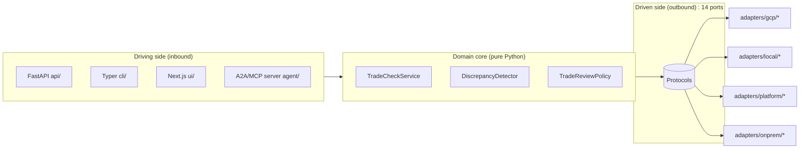
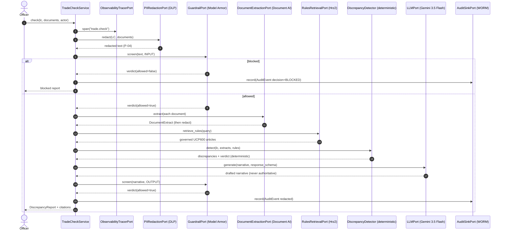
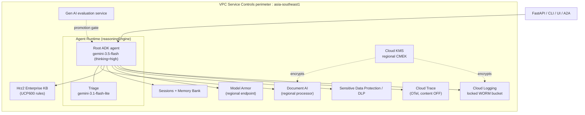
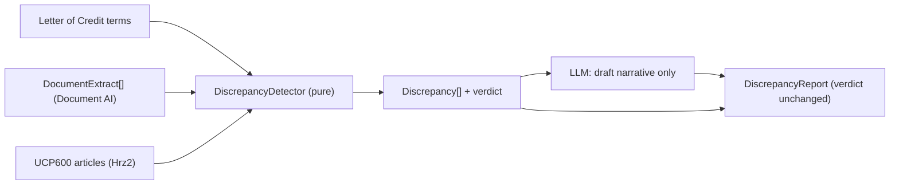
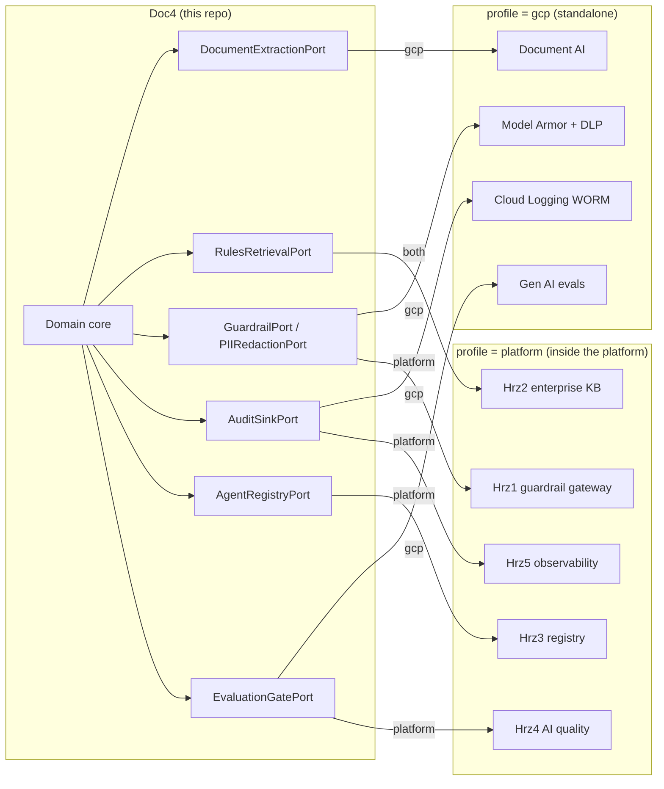

# Architecture : Doc4 Trade-Finance Document Checker

This document goes deeper than the [README](README.md): the complete port to adapter table,
the check pipeline as a sequence diagram, the runtime topology on Agent Runtime, and the
relationship to the Hrz1 to Hrz5 platform dependencies.

The contract layer is authoritative : see [`SPEC.md`](SPEC.md). This file describes how the
pieces fit together; it does not redefine them.

---

## 1. Hexagonal overview

Doc4 is a **ports-and-adapters** (hexagonal) application. The domain core in
[`src/trade_finance_checker/domain/`](src/trade_finance_checker/domain/) owns all
orchestration and has **no** dependency on Google Cloud, ADK, FastAPI, or any framework :
only the Python standard library. Everything the domain needs from the outside world is
expressed as a `typing.Protocol` **port**; concrete **adapters** are bound to ports by
dotted path in [`config/settings.yaml`](config/settings.yaml) and instantiated lazily by
the `Container` in [`config.py`](src/trade_finance_checker/config.py).

The `Container` picks the adapter for the active `profile`
(`gcp` | `local` | `platform` | `onprem`), falling back to the `gcp` entry. Because every
adapter constructor is `def __init__(self, settings: Settings) -> None` and **all** Google
Cloud SDK imports are **lazy**, the local / on-prem / test profiles import and run with **no
GCP SDK installed**; the default `local` path imports no google-cloud package at all.

---

## 2. The 14 ports to adapter table

Every port is an `@runtime_checkable` `Protocol` under
[`src/trade_finance_checker/ports/`](src/trade_finance_checker/ports/). The `gcp` column is
the primary managed-service adapter; the `local` column is a WORKING SDK-free offline
implementation (the dev / test default); the `platform` column (where present) is a thin HTTP
client to a platform service; the `onprem` column is a placeholder stub that **constructs
cleanly and satisfies the Protocol** but raises `NotImplementedError` from every method.

| # | Port (`Protocol`) | Concern | `gcp` adapter | `local` adapter (SDK-free) | `platform` adapter | `onprem` placeholder |
|---|-------------------|---------|---------------|----------------------------|--------------------|----------------------|
| 1 | `DocumentExtractionPort` | LC + document parsing | `gcp.document_ai_extraction:DocumentAiExtractionAdapter` | `local.extraction:LocalDocumentExtractionAdapter` (text / pypdf parser) | n/a | `onprem.extraction:OnPremExtractionAdapter` |
| 2 | `RulesRetrievalPort` | UCP600 rules (Hrz2, R3) | `platform.remote_rules:RemoteRulesAdapter` | `local.rules:LocalFtsRulesAdapter` (SQLite FTS5, BM25) | `platform.remote_rules:RemoteRulesAdapter` | `onprem.rules:OnPremRulesAdapter` |
| 3 | `LLMPort` | Narrative drafting / triage | `gcp.gemini_llm:GeminiLLMAdapter` | `local.llm:LocalDeterministicLLMAdapter` (schema-driven) | n/a | `onprem.llm:OnPremLLMAdapter` |
| 4 | `GuardrailPort` | Input/output screening (Hrz1) | `gcp.model_armor_guardrail:ModelArmorGuardrailAdapter` | `local.guardrail:LocalHeuristicGuardrailAdapter` | `platform.remote_guardrail:RemoteGuardrailAdapter` | `onprem.guardrail:OnPremGuardrailAdapter` |
| 5 | `PIIRedactionPort` | PII de-identification (Hrz1, P-04); both live families read the jurisdiction packs in `domain/pii_patterns.py` | `gcp.dlp_redaction:DlpRedactionAdapter` | `local.redaction:LocalRegexRedactionAdapter` | n/a | `onprem.redaction:OnPremRedactionAdapter` |
| 6 | `AgentRuntimePort` | Hosted agent | `gcp.agent_runtime:AgentRuntimeAdapter` | `local.runtime:LocalAgentRuntimeAdapter` (in-process) | n/a | `onprem.runtime:OnPremAgentRuntimeAdapter` |
| 7 | `SessionPort` | Per-case session state | `gcp.vertex_sessions:VertexSessionsAdapter` | `local.session:LocalSessionAdapter` | n/a | `onprem.session:OnPremSessionAdapter` |
| 8 | `MemoryPort` | Durable officer memory | `gcp.vertex_memory_bank:VertexMemoryBankAdapter` | `local.memory:LocalMemoryAdapter` | n/a | `onprem.memory:OnPremMemoryAdapter` |
| 9 | `AuditSinkPort` | WORM audit (Hrz5, P-07) | `gcp.cloud_logging_audit:CloudLoggingAuditAdapter` | `local.audit:LocalAppendOnlyAuditAdapter` | `platform.remote_audit:RemoteAuditAdapter` | `onprem.audit:OnPremAuditAdapter` |
| 10 | `ObservabilityTracerPort` | Tracing + FinOps (Hrz5) | `gcp.cloud_trace_tracer:CloudTraceTracerAdapter` | `local.tracer:LocalNoopTracerAdapter` | n/a | `onprem.tracer:OnPremTracerAdapter` |
| 11 | `EvaluationGatePort` | Eval gate (Hrz4, P-08) | `gcp.genai_eval:GenAiEvalAdapter` | `local.evaluation:LocalOfflineEvalAdapter` (delegates to eval/run_eval.py) | `platform.remote_evaluation:RemoteEvaluationAdapter` | `onprem.evaluation:OnPremEvalAdapter` |
| 12 | `AgentRegistryPort` | A2A registry (Hrz3) | `gcp.a2a_registry:A2ARegistryAdapter` | `local.registry:LocalRegistryAdapter` | `platform.remote_registry:RemoteRegistryAdapter` | `onprem.registry:OnPremRegistryAdapter` |
| 13 | `ToolCatalogPort` | Governed MCP tools (Hrz3) | `gcp.mcp_tool_catalog:McpToolCatalogAdapter` | `local.tool_catalog:LocalToolCatalogAdapter` | n/a | `onprem.tool_catalog:OnPremToolCatalogAdapter` |
| 14 | `IdentityPort` | Server-verified end-user identity (P-02) | `gcp.iap_identity:IapIdentityAdapter` (verifies the Cloud IAP assertion) | `local.identity:LocalPersonaIdentityAdapter` (seeded dev personas, no IdP) | `gcp.iap_identity:IapIdentityAdapter` | `onprem.identity:OnPremIdentityAdapter` |

> Dotted paths above are relative to the `trade_finance_checker.adapters` package; the
> fully-qualified bindings are in [`config/settings.yaml`](config/settings.yaml) under
> `adapters:` and are the build contract. Four ports have a `platform` entry (rules,
> guardrail, audit, registry) plus evaluation, matching the platform services Doc4 consumes.
> The rules port's default `gcp` binding also resolves to the Hrz2 remote client, because the
> governed UCP600 set lives in Hrz2 even in the standalone managed profile (R3).

**Server-verified identity (no client-asserted actor).** The `IdentityPort` (row 14) resolves a
verified `Principal` from the inbound request headers at the API boundary (`api/security.py`
`get_principal`, a `CurrentPrincipal` dependency on every artifact route). The request body
carries no `actor`: the verified subject becomes the audit actor threaded into the domain
service, and a resolution failure is a 401. Profiles: `local` seeds dev personas (no IdP,
selected by `X-Dev-Persona`), `gcp`/`platform` verify the Cloud IAP assertion, `onprem` is the
client-IdP placeholder. The UI embeds same-origin (basePath + embed mode) or runs standalone,
with CSP `frame-ancestors` and per-tenant CORS on the embedding surface. See
[`docs/embedding-and-identity.md`](docs/embedding-and-identity.md).

---

## 3. The check pipeline

The `TradeCheckService` owns orchestration and calls only ports. Because Doc4 handles
trade-party PII, the **full Hrz1 safety pipeline** runs on every check (rule R1):

Key invariants:
- **Redact before everything** : PII never reaches the model, a span, or the WORM sink
  (P-04). The `AuditEvent` stores `redacted_prompt` / `redacted_response`.
- **Both directions screened** : INPUT before extraction, OUTPUT before return (Hrz1 / R1).
- **Deterministic verdict** : the verdict and the discrepancy set come from
  `DiscrepancyDetector`, never the LLM. A misbehaving model cannot add, drop, or re-grade a
  finding (a unit test enforces this).
- **Always human-reviewed** : `requires_human_review = True` on every report (P-06). The
  officer decides whether to pay, refuse, or seek a waiver.

---

## 4. Runtime topology on Agent Runtime

In the `gcp` profile, the ADK agent is hosted on **Agent Runtime** (ex-Agent Engine, a
`reasoningEngine` resource) inside a VPC-SC perimeter in `asia-southeast1`.

- **One region for everything** (`asia-southeast1`) **except Document AI**, which serves
  `asia-southeast1` only once Google grants single-region access and routes to the `us`
  multi-region until then; regional endpoints + per-service CMEK give the residency guarantee
  that a global endpoint would not, and the Document AI deviation is to a named jurisdiction
  for exactly that reason.
- **Eval gate** is a promotion-time check, not an inline request dependency.

---

## 5. Why the verdict is deterministic

A trade-finance discrepancy decision is consequential and auditable: the bank pays, refuses,
or seeks a waiver based on it. So the verdict and the discrepancy set are computed by
**pure, deterministic** code in
[`detector.py`](src/trade_finance_checker/domain/detector.py), not by the LLM. The model is
used only to draft the examiner narrative, and the prompt and a unit test both forbid it
from changing a finding. This keeps the consequential output explainable, reproducible, and
free of model variance, while still giving the officer a readable summary.

---

## 6. Dependency relationship to the platform (Hrz1 to Hrz5)

Doc4 (catalog **Doc4**, group `doc`) is a leaf application that depends on five platform
services. The dependency rules **R1..R6** (see [`COMPLIANCE.md`](COMPLIANCE.md)) require that
those concerns are *not* re-implemented in Doc4 but consumed from the platform. Doc4 satisfies
this two ways without changing the domain:

| Dependency | Repo | Backs Doc4 ports | HTTP contract (SPEC §6) |
|------------|------|----------------|-------------------------|
| **Hrz1** Guardrail Gateway | `agent-guardrail-gateway` | `GuardrailPort`, `PIIRedactionPort` | `POST /v1/guardrail/screen` |
| **Hrz2** Enterprise KB | `enterprise-knowledge-base` | `RulesRetrievalPort` | `POST /v1/search` |
| **Hrz3** Registry | `agent-registry` | `AgentRegistryPort` | `POST/GET /v1/agents` |
| **Hrz4** AI Quality | `model-quality-gate` | `EvaluationGatePort` | `POST /v1/evaluations`, `POST /v1/gate` (bundle `doc4-trade-finance`) |
| **Hrz5** Observability/Audit | `agent-observability` | `AuditSinkPort` | `POST /v1/audit` |

The `platform` adapters (`adapters/platform/remote_*.py`) are thin HTTP clients whose JSON
field names mirror the domain dataclasses exactly (enums as strings), so swapping from the
direct-GCP adapter to the remote client is a binding change, never a domain change.

---

## 7. Why this shape

- **No vendor lock-in (P-02):** the domain depends on Protocols, not SDKs. The `local`
  family runs the whole pipeline off-cloud and the on-prem placeholder adapters prove
  interface parity, making the exit path concrete (P-12).
- **Testable without the cloud:** lazy SDK imports + the SDK-free `local` adapter family
  mean the whole suite runs under the `local` profile (the dev / test default) with no
  Google Cloud packages installed.
- **Residency by construction:** one region, regional endpoints, per-service CMEK, VPC-SC.
- **Auditable by construction:** redact-before-everything, WORM audit, cited discrepancies,
  a deterministic verdict, maker-checker, and a promotion eval gate.

## Kernel and vertical boundary

`domain/kernel.py` is the stable evidence, model-boundary, safety, redaction, audit, and
agent-discovery seam. Letters of credit, presented documents, UCP600 rules, discrepancies,
and detector services form the replaceable trade-finance vertical. A fork keeps the kernel
and port contracts while replacing the vertical layer.
