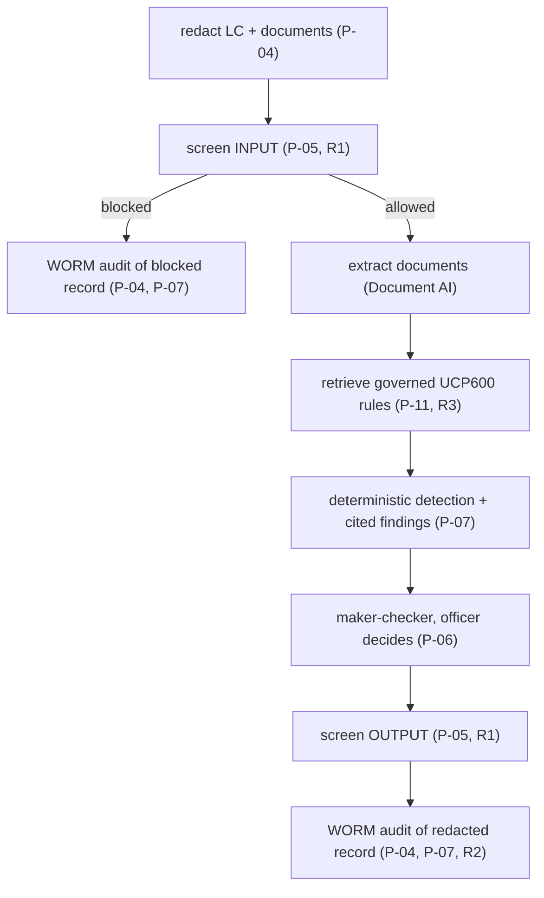

# Compliance : principle-to-control mapping

This document maps **every** GRC General Principle (**P-01..P-12**) and platform dependency
rule (**R1..R6, R8**) to the concrete control that enforces it in *this* repo : a file, an
adapter, a config value, or a Terraform resource. It is the auditor's index: each row points
to where the control actually lives, not a policy statement.

> Scope note: this is a reference build. The mappings below show *how the architecture
> enforces each principle*; a production deployment still needs your own legal, security, and
> model-risk sign-off (see [`README`](README.md) disclaimer). Synthetic LC / trade documents
> are fictional; UCP600 references are illustrative.

Legend for "where": paths are relative to the repo root. Port modules live under
`src/trade_finance_checker/ports/`; adapters under `src/trade_finance_checker/adapters/`;
domain under `src/trade_finance_checker/domain/`.

---

## A. General Principles (P-01..P-12)

| Principle | Statement | Concrete control in this repo | Where |
|-----------|-----------|-------------------------------|-------|
| **P-01** | Data residency / sovereignty : keep regulated data in-country | **PARTIAL, and the gap is Document AI.** Compute, keys, audit, Model Armor and model processing take their location from `region`, chosen at deploy time and validated against the `allowed_regions` residency allowlist (default `asia-southeast1`; extending that list is the review point), behind a VPC-SC perimeter. **Document AI extraction is NOT in-country:** the service reaches `asia-southeast1` only once Google grants single-region access, so both the processor and the adapter default to the `us` MULTI-REGION — LC and presentation bytes are parsed in the United States. `us` names one jurisdiction; it is not `global`. Set `docai_location` and `TRADE_FINANCE_DOCAI_LOCATION` to `asia-southeast1` together the day access lands; both halves refuse a location that is neither the deploy region nor a named multi-region, `global` by name | `config/settings.yaml` (`region`, `document_ai.location`), `Settings.region`, `Settings.__post_init__`, `infra/terraform/variables.tf` (`docai_location`), `infra/terraform/document_ai.tf`, `docs/runbook.md` |
| **P-02** | No vendor lock-in : ports & adapters, swappable backends | 13 `Protocol` ports; adapters bound by dotted path; one-line `profile` switch across `gcp` / `local` / `platform` / `onprem`; the SDK-free `local` family runs the whole pipeline off-cloud and the on-prem placeholder family satisfies every Protocol | `src/trade_finance_checker/ports/*`, `config.py` (`Container`), `config/settings.yaml` (`adapters:`), `adapters/local/*`, `adapters/onprem/*` |
| **P-03** | Least-privilege access & governed tools | Governed, least-privilege MCP tool catalog lists only the three skills Doc4 offers; A2A AgentCard advertises only declared skills | `ToolCatalogPort` (`ports/governance.py`), `adapters/gcp/mcp_tool_catalog.py`, `AgentCard`/`AgentSkill` in `domain/models.py` |
| **P-04** | Data minimisation : redact trade-party PII before model & logs | DLP de-identification of the LC, document extracts and narrative **before** any model call, span, or audit write; `AuditEvent` stores only `redacted_prompt` / `redacted_response`. What counts as an identifier is a jurisdiction pack (`pii.jurisdictions`, default SG/HK/JP/AU: NRIC, HKID, My Number, TFN, plus universal email / phone / account numbers), and one pattern source feeds the local redactor, the DLP custom info types and the eval gate's leak check, so a corridor outside APAC is a config change and the three cannot silently disagree | `PIIRedactionPort` (`ports/safety.py`), `domain/pii_patterns.py`, `adapters/gcp/dlp_redaction.py:DlpRedactionAdapter`, `adapters/local/redaction.py:LocalRegexRedactionAdapter`, `TradeCheckService._redact_request` / `_redact_extract`, `config.py:PiiSettings` |
| **P-05** | Input/output safety : screen for injection, jailbreak, RAI | Model Armor screens INPUT and OUTPUT (`sanitizeUserPrompt` / `sanitizeModelResponse`); a blocked presentation short-circuits to a blocked report + `Decision.BLOCKED` audit | `GuardrailPort` (`ports/safety.py`), `adapters/gcp/model_armor_guardrail.py:ModelArmorGuardrailAdapter`, `TradeCheckService._blocked_report` |
| **P-06** | Human-in-the-loop / maker-checker for consequential actions | `TradeReviewPolicy` always sets `requires_human_review=True`; the officer decides (pay / refuse / waive); `DiscrepancyReport.requires_human_review` defaults `True`; HIGH/CRITICAL findings escalate the audit decision; the escalation is ROUTED to the Hrz7 maker-checker console (rule R8), not left as a boolean | `domain/review_policy.py:TradeReviewPolicy`, `DiscrepancyReport.requires_human_review`, `Decision.ESCALATED`, `ports/review_router.py`, `adapters/*/review_router.py` |
| **P-07** | Immutable audit trail with traceable provenance | WORM audit to a **locked** Cloud Logging bucket (retention 2557 days); every discrepancy cited to a UCP600 article / LC term / document via `Citation` | `AuditSinkPort` (`ports/observability.py`), `adapters/gcp/cloud_logging_audit.py:CloudLoggingAuditAdapter`, `Citation` in `domain/models.py`, `LoggingSettings.retention_days`, `infra/terraform/logging_worm.tf` |
| **P-08** | Model risk / quality gate before promotion | Eval gate scoring discrepancy recall / precision / citation accuracy / PII safety; `EvalReport.passed` requires every metric to clear threshold; CI blocks promotion | `EvaluationGatePort` (`ports/observability.py`), `adapters/gcp/genai_eval.py:GenAiEvalAdapter`, `eval/run_eval.py`, the hosted Cloud Build check, `EvalReport`/`EvalMetricResult` |
| **P-09** | Observability without exposing sensitive content | Cloud Trace via OpenTelemetry with **message-content capture OFF**; spans carry structure + token usage only | `ObservabilityTracerPort` (`ports/observability.py`), `adapters/gcp/cloud_trace_tracer.py:CloudTraceTracerAdapter`, `agent/callbacks.py:configure_span_privacy`, `TokenUsage` |
| **P-10** | Encryption with customer-managed keys | Regional CMEK (Cloud KMS) encrypts Document AI output staging, the log bucket, and more | `Settings.kms_key`, `config/settings.yaml` (`kms_key`), `infra/terraform/kms.tf`, `docs/runbook.md` (key rotation) |
| **P-11** | Data freshness / accuracy : no stale rule set | UCP600 articles retrieved at runtime from the governed Hrz2 KB (never vendored), so the rule set stays aligned with the publisher; the article registry lists the expected articles | `RulesRetrievalPort` (`ports/rules.py`), `adapters/platform/remote_rules.py`, `pipelines/sources/registry.yaml`, `pipelines/seed_rules.py` |
| **P-12** | Exit / portability : a documented, tested migration path | The `local` profile proves the domain runs entirely off-cloud (no Google Cloud, no API key); the on-prem placeholder adapters satisfy every Protocol (contract tests assert parity for both `local` and `onprem`); migration to Google Distributed Cloud with **zero** domain changes; documented checklist | `adapters/local/*`, `adapters/onprem/*`, `docs/onprem-migration.md`, contract tests in `tests/contract/`, `config/settings.yaml` (`profile: local` / `onprem`) |

---

## B. Dependency rules (R1..R6, R8)

The dependency rules govern how Doc4 (a leaf `doc` application) consumes the shared platform
services rather than re-implementing their concerns. Doc4 honours them by binding the relevant
ports to the `platform` profile's remote HTTP clients when deployed inside the platform, and
to direct-GCP adapters when standalone.

| Rule | Statement | Concrete control in this repo | Where |
|------|-----------|-------------------------------|-------|
| **R1** | Use the central **Hrz1 Guardrail Gateway**; do not roll your own safety. Doc4 handles PII, so the full Hrz1 pipeline (redact, screen INPUT, screen OUTPUT) runs on every check | `GuardrailPort` + `PIIRedactionPort` bound to `RemoteGuardrailAdapter` under `platform`; full pipeline in `TradeCheckService` | `adapters/platform/remote_guardrail.py:RemoteGuardrailAdapter`, `config/settings.yaml` (`guardrail.platform`), `domain/trade_check_service.py`, SPEC §6 Hrz1 |
| **R2** | Emit audit to the central **Hrz5 Observability/Audit** service | `AuditSinkPort` bound to `RemoteAuditAdapter` under `platform`; `AuditEvent` JSON mirrors the domain dataclass (enums as strings) | `adapters/platform/remote_audit.py:RemoteAuditAdapter`, `domain/serialization.py:to_jsonable`, SPEC §6 Hrz5 |
| **R3** | Consume the governed rule set from the **Hrz2 Enterprise KB**; do not vendor UCP600 | `RulesRetrievalPort` bound to `RemoteRulesAdapter` (Hrz2 `/v1/search`) for both `gcp` and `platform`; the repo ships only an article registry | `adapters/platform/remote_rules.py:RemoteRulesAdapter`, `config/settings.yaml` (`rules`), `pipelines/sources/registry.yaml`, SPEC §6 Hrz2 |
| **R4** | Register the agent in the **Hrz3 Agent Registry**; publish an A2A AgentCard | `AgentRegistryPort` bound to `RemoteRegistryAdapter` under `platform`; AgentCard published at `/.well-known/agent-card.json` | `adapters/platform/remote_registry.py:RemoteRegistryAdapter`, `adapters/gcp/a2a_registry.py`, `agent/agent_card.py`, SPEC §6 Hrz3 |
| **R5** | Pass the **Hrz4 eval gate** before promotion | Promotion blocked unless `EvalReport.passed`; `RemoteEvaluationAdapter` consumes Hrz4 `/v1/evaluations`; offline gate enforces it in CI | `EvaluationGatePort`, `adapters/platform/remote_evaluation.py`, `eval/run_eval.py`, the hosted Cloud Build check, SPEC §6 Hrz4 |
| **R6** | Intake / interop via **A2A v1.0 + MCP** (Rsk3 at intake); stable contracts mirror domain types | A2A AgentCard + `to_a2a`; governed MCP tool catalog; remote-client JSON field names mirror domain dataclasses so platform and standalone are wire-compatible | `agent/` (A2A/MCP server), `adapters/gcp/mcp_tool_catalog.py`, `domain/serialization.py`, SPEC §6 |
| **R8** | Route `requires_human_review` to Hrz7 | Every escalated discrepancy report is submitted to the Hrz7 Human-Review & Maker-Checker Console through the shared `review-kit` client (redact-before-wire); `local` enqueues to a transactional outbox so the routing path runs offline, `gcp`/`platform` submit over S2S to Hrz7's service intake (`HUMAN_REVIEW_URL`) | `ports/review_router.py`, `adapters/{local,platform,onprem}/review_router.py`, `adapters/_review_payload.py` |

---

## C. How the controls compose in one check

The pipeline (see [`ARCHITECTURE.md`](ARCHITECTURE.md) §3) chains the controls so a single
check satisfies several principles at once:

> All inside a content-free trace span (P-09).

Cross-cutting throughout: region pin + CMEK + VPC-SC (P-01, P-10), Protocol-based
swappability (P-02), governed tools (P-03), a promotion eval gate (P-08, R5), and a
deterministic verdict the LLM cannot override. The exit story (P-12) is what lets the entire
chain move to Google Distributed Cloud without rewriting the domain : see
[`docs/onprem-migration.md`](docs/onprem-migration.md).

---

## D. Verification

| Claim | How to verify |
|-------|---------------|
| Local + on-prem adapters satisfy every Protocol (P-02, P-12) | Contract tests in `tests/contract/` run under `TRADE_FINANCE_PROFILE=local` with **no** Google Cloud SDK installed and assert parity for both the `local` (working) and `onprem` (fail-fast) families: `make test` |
| Redact-before-model / before-audit (P-04) | Unit tests assert the audited prompt carries no raw PII tokens (NRIC / email / account); `tests/unit/test_redaction_service.py` pins the jurisdiction packs (SG/HK/JP/AU) the redactor masks, and the eval gate's `pii_safety >= 0.99` runs the REAL redactor over one golden presentation per market, each carrying that market's own identifier |
| Both directions screened (P-05, R1) | Unit tests assert `guardrail.screen(INPUT)` and `guardrail.screen(OUTPUT)` are both invoked, and that a blocked verdict short-circuits |
| Verdict is deterministic (model cannot override) | `test_llm_never_overrides_the_deterministic_verdict` feeds a lying LLM and asserts the verdict and discrepancy count are unchanged |
| Eval gate blocks promotion (P-08, R5) | `make eval` exits non-zero on failure; the hosted Cloud Build check |
| WORM retention is set & irreversible (P-07) | `LoggingSettings.retention_days = 2557`; Terraform locks the bucket **last** (`docs/runbook.md`) |
| Region fail-fast (P-01) | `terraform plan` errors if Document AI is unavailable in `asia-southeast1` (`docs/runbook.md`) |

## Adopter-owned regulator crosswalk

This appendix is intentionally adopter-owned. The adopting bank must determine legal and
contractual applicability, nominate owners, and link approved evidence before production.

| Reference topic | Candidate control evidence | Applicability | Adopter owner | Approved evidence |
|---|---|---|---|---|
| UCP600 examination procedure | governed rule retrieval; cited deterministic discrepancy set | To assess | To assign | To link |
| MAS TRM model and change controls | P-06, P-08; maker-checker and eval gate | To assess | To assign | To link |
| MAS data protection and residency | P-04, P-05; redaction, CMEK, perimeter | To assess | To assign | To link |
