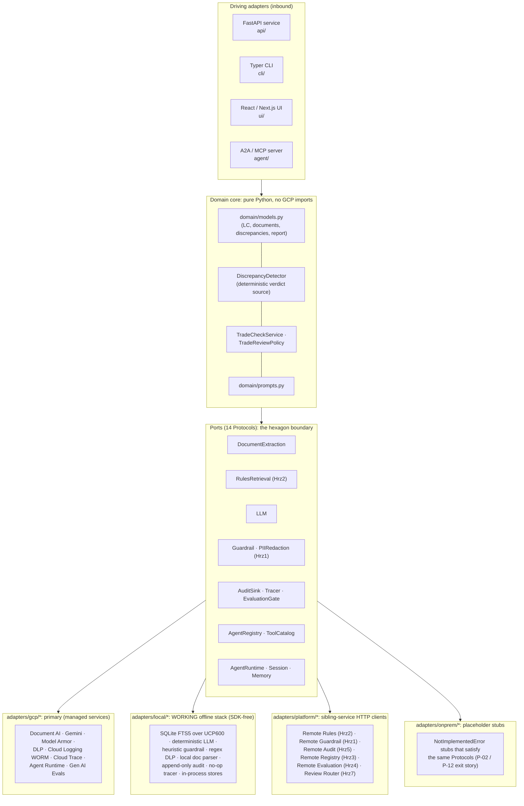
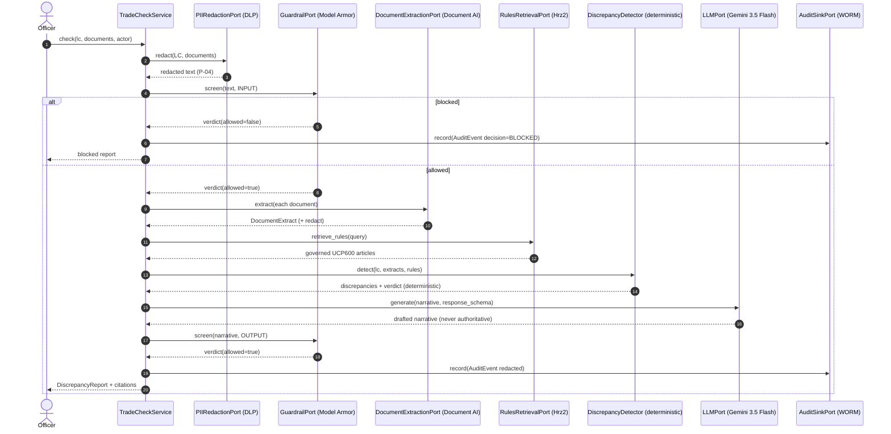
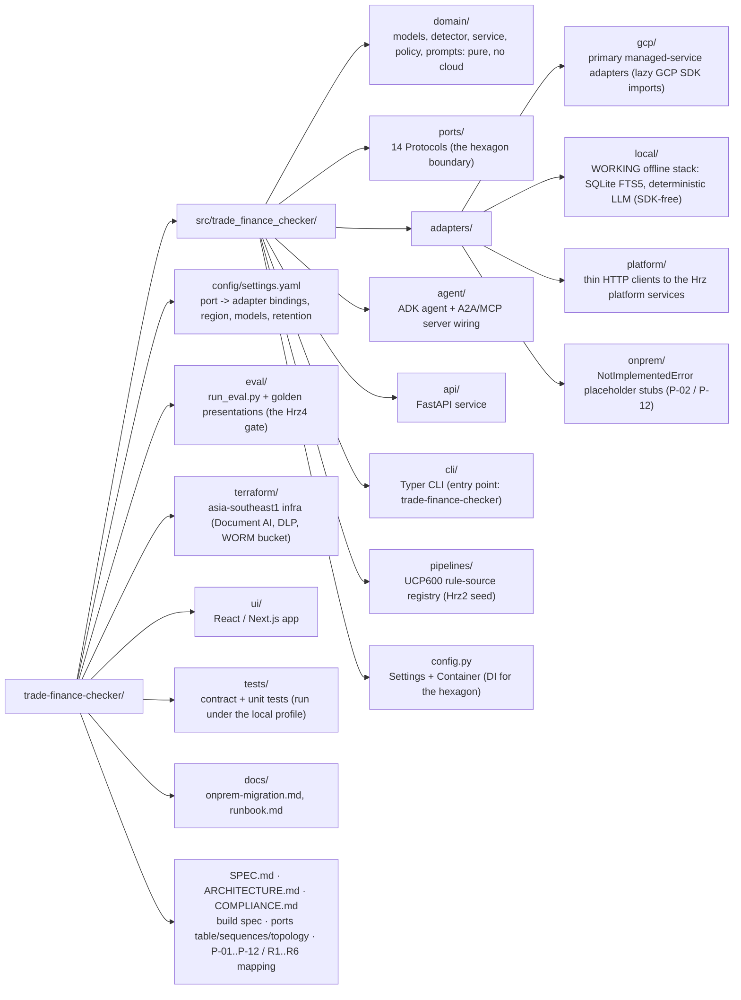

# Doc4: Trade-Finance Document Checker

**Industries:** Banking (trade finance), Logistics & shipping, Commodities trading, Export-import manufacturing, Trade-credit insurance

> Parses a **Letter of Credit** and the presented document set (invoice, bill of lading,
> insurance, packing list, certificate of origin, draft) and detects **discrepancies**
> against the LC terms and the **UCP600** rules. Decision support for a trade-finance
> officer in **Transaction Banking**, not an approval. Built ports-and-adapters on the
> **Gemini Enterprise Agent Platform**, pinned to `asia-southeast1` (Singapore) for data
> residency.

[](LICENSE)
[](pyproject.toml)

> **Reference build, not affiliated with, endorsed by, or sponsored by Google.** This is a
> public engineering portfolio piece. "Gemini Enterprise Agent Platform", "Document AI",
> "Agent Runtime", "Model Armor", and other Google Cloud product names are trademarks of
> Google LLC and are used here only to describe the architecture. UCP600 references are
> illustrative. No warranty; see [`LICENSE`](LICENSE). Do not deploy against live regulated
> workloads without your own legal, security, and model-risk sign-off.

---

## 1. What Doc4 produces

Doc4 examines one **presentation** under a documentary credit and returns **three cited
artifacts**, each carrying examiner-grade provenance (the LC term, the UCP600 article, or
the presented document and page):

| # | Artifact | Domain type | Produced by |
|---|----------|-------------|-------------|
| 1 | **DiscrepancyReport**: the full check result, with a deterministic verdict (COMPLIANT or DISCREPANT) and a discrepancy count | `DiscrepancyReport` | `TradeCheckService.check()` |
| 2 | **Discrepancy[]**: each finding (UCP600 article, document type, field, expected per LC/UCP600, found, severity, citations) | `tuple[Discrepancy, ...]` | `DiscrepancyDetector.detect()` |
| 3 | **PresentationSummary**: the parsed LC terms + the documents checked, for traceability | `PresentationSummary` | `TradeCheckService.check()` |

Catalog identity: **Doc4**, group **`doc`** (document automation), priority **P2**, buyer
**Transaction Banking**. Mandatory platform dependencies: **Hrz1** Guardrail Gateway, **Hrz2**
Enterprise KB (the governed UCP600 rule set), **Hrz4** AI Quality (eval gate at promotion),
**Hrz5** Observability/Audit, **Hrz7** Human-Review Console (R8 review routing). Each
dependency is a separate repo; see [§9 Platform dependencies](#9-platform-dependencies).

The **verdict and the discrepancy set are computed by deterministic, pure-domain code**
([`detector.py`](src/trade_finance_checker/domain/detector.py)); the LLM only drafts the
examiner narrative and can never invent, suppress, or re-grade a finding. Every artifact
type and citation is a pure-stdlib dataclass in
[`domain/models.py`](src/trade_finance_checker/domain/models.py), the heart of the hexagon,
with **zero** dependency on Google Cloud, ADK, or any framework.

---

## 2. Architecture: the hexagon

The domain core owns all orchestration and speaks only to **ports** (Python `Protocol`s).
Four interchangeable adapter families implement those ports (`gcp`, `local`, `platform`,
`onprem`). Switching the entire managed stack to the offline local stack, or to an on-prem
one, is a **one-line profile change** (`TRADE_FINANCE_PROFILE`) with no domain edits, the
proof of General Principle **P-02** (no vendor lock-in).



- **Driving (inbound) adapters**: the API, CLI, UI, and the A2A/MCP server, which translate
  external requests into domain calls.
- **Domain core**: `TradeCheckService` runs the pipeline by composing port calls; the
  `DiscrepancyDetector` decides the verdict. It never imports a cloud SDK.
- **Ports**: 13 `typing.Protocol`s under
  [`src/trade_finance_checker/ports/`](src/trade_finance_checker/ports/). Each is
  `@runtime_checkable` so contract tests can assert any adapter satisfies it.
- **Driven (outbound) adapters**: `gcp` (primary, real SDK calls), `local` (a WORKING
  offline stack: SQLite FTS5, deterministic LLM, no cloud, no API key), `platform` (thin
  HTTP clients to the Hrz platform services), `onprem` (placeholder stubs).

See [`ARCHITECTURE.md`](ARCHITECTURE.md) for the full 13-port table, the check-pipeline
sequence diagram, and the runtime topology.

---

## 3. Pinned GCP stack (current GA names, mid-2026)

> Platform note: the product is **Gemini Enterprise Agent Platform**; the API host is
> still `aiplatform.googleapis.com`. Everything is pinned to
> `asia-southeast1`. The authoritative source for the stack is [`SPEC.md`](SPEC.md) §3.

| Concern | Service (current name) | Identifier |
|---------|------------------------|------------|
| Agent framework | ADK (Python) | `google-adk==2.7.1` |
| Reasoning model | Gemini 3.5 Flash | `gemini-3.5-flash` (thinking=high) |
| Triage model | Gemini 3.1 Flash-Lite | `gemini-3.1-flash-lite` |
| Unified SDK | Google GenAI SDK | `google-genai` |
| Document extraction | **Document AI** | `google-cloud-documentai` (regional processor) |
| UCP600 rule set | **Hrz2 Enterprise KB** (File Search) | `POST /v1/search` (`KNOWLEDGE_BASE_URL`) |
| Runtime | **Agent Runtime** (ex-Agent Engine) | `google-cloud-aiplatform[agent_engines,adk]`; `reasoningEngine` |
| Sessions / Memory | Agent Platform Sessions / Memory Bank | ADK `VertexAiSessionService` / `VertexAiMemoryBankService` |
| Guardrail | Model Armor | `modelarmor.asia-southeast1.rep.googleapis.com` `:sanitizeUserPrompt` / `:sanitizeModelResponse` |
| PII redaction | Sensitive Data Protection / DLP | `google-cloud-dlp` `deidentifyContent` |
| Audit (WORM) | Cloud Logging locked bucket + Audit Logs | retention 2557 days (~7y) |
| Tracing | Cloud Trace via OpenTelemetry | `opentelemetry-exporter-gcp-trace`; content capture **OFF** |
| Eval gate | Gen AI evaluation service | `vertexai.Client(...).evals` |
| Interop | A2A v1.0 + MCP 2026-07-28 | AgentCard `/.well-known/agent-card.json`; ADK `to_a2a`, `McpToolset` |
| Sovereignty | VPC-SC, regional CMEK, Org Policy, Assured Workloads | `asia-southeast1` |

**Gotchas honoured by the build** (SPEC §3): regional endpoints + per-service CMEK for
residency (the *global* endpoint gives none); message-content capture is **OFF** in spans
(PII); the locked log bucket is **irreversible** (retention is a Terraform var); the build
**never** uses the floating ADK default model or `gemini-2.0-flash` (discontinued); one
built-in tool per agent.

---

## 4. Quickstart

### 4.1 `local` profile: a WORKING offline stack, no GCP, no API key

The **`local`** profile is the dev / test default. It binds every port to a real,
deterministic SDK-free adapter and runs the whole check pipeline end to end with **no
Google Cloud, no API key, and no running emulators**: SQLite **FTS5** over the governed
UCP600 rule set, a deterministic schema-driven LLM for the narrative, a heuristic guardrail,
jurisdiction-driven regex DLP redaction, a local document parser, an append-only audit store, and in-process
session / memory / registry stores. The core dependencies are framework-light; the GCP SDKs
live in the `[gcp]` extra and are never imported on this path.

```bash
git clone https://github.com/portable-genai/trade-finance-checker.git
cd trade-finance-checker

python3.12 -m venv .venv && source .venv/bin/activate
pip install -e ".[dev]"          # core + dev tooling, NO google-cloud-* packages

export TRADE_FINANCE_PROFILE=local
make lint test                   # ruff + mypy + pytest -m 'not integration'
```

Run a real check offline and get a cited discrepancy report (no seed step needed: the local
rules index self-seeds the governed UCP600 set on first use):

```bash
export TRADE_FINANCE_PROFILE=local
trade-finance-checker check eval/samples/presentation.json
# => Presentation LC-DEMO-0002 : DISCREPANT, 7 discrepancies, each cited to a UCP600 article.
make check-local                 # the same smoke run as a Make target
```

**Optional higher-fidelity local** (never required): when the standard
`FIRESTORE_EMULATOR_HOST` env var is set and the `[gcp]` client lib is installed, the
session / memory / registry adapters route to the Firestore emulator (the google client is
imported lazily, only on that branch). Unset, they use SDK-free in-process stores. There is
no emulator for Document AI, Gemini, Model Armor, DLP or FTS5 retrieval, so those stay on the
SDK-free workaround unconditionally.

### 4.2 `onprem` profile: fail-fast migration target

The `onprem` profile binds every port to a placeholder adapter that raises
`NotImplementedError` from every method (the documented Google Distributed Cloud exit). A
CLI command under `onprem` exits **2** with a migration message rather than a traceback:

```bash
export TRADE_FINANCE_PROFILE=onprem
trade-finance-checker check eval/samples/presentation.json; echo "exit=$?"   # exit=2
```

Contract tests confirm the on-prem placeholders satisfy the same 13 Protocols as the GCP and
local adapters (interface parity), making the **exit / portability** story (P-12) real; see
[`docs/onprem-migration.md`](docs/onprem-migration.md).

### 4.3 `gcp` profile: real managed stack in `asia-southeast1`

```bash
pip install -e ".[gcp,dev]"      # adds google-adk, google-genai, documentai, dlp, ...

export GOOGLE_CLOUD_PROJECT=your-sg-project
export TRADE_FINANCE_PROFILE=gcp                 # explicit opt-in to the managed stack (prod)
export TRADE_FINANCE_KMS_KEY="projects/.../locations/asia-southeast1/keyRings/.../cryptoKeys/..."
export TRADE_FINANCE_DOCAI_PROCESSOR="projects/.../locations/asia-southeast1/processors/..."
gcloud auth application-default login

make tf-plan                      # review, then `terraform apply` (see docs/runbook.md)
make run-api                      # FastAPI on :8094, profile=gcp
```

Everything is keyed off [`config/settings.yaml`](config/settings.yaml), which resolves
`${ENV_VAR}` tokens at load time. Switching profiles never touches code, only the
`TRADE_FINANCE_PROFILE` env var (or the `profile:` key).

**Unset is a third state, not a synonym for `local`.** When neither the variable nor the
settings file names a profile, the SDK-free `local` adapters still bind (nothing else can, with
no cloud SDK installed) but the run counts as unconsented: the seeded no-auth personas are
refused, the localhost CORS fallback is empty, and the bind guard still confines the process to
loopback. Name `local` deliberately for a dev or demo run.

---

## 5. Running the surfaces

| Surface | Command | Notes |
|---------|---------|-------|
| **API** (FastAPI) | `make run-api` | `POST /v1/check`, `POST /v1/extract` (no client `actor`: the audit actor is the server-verified identity), `GET /v1/personas`, `/healthz`, plus the A2A AgentCard at `/.well-known/agent-card.json`; OpenAPI at `/docs`. See [`docs/embedding-and-identity.md`](docs/embedding-and-identity.md). |
| **CLI** (Typer) | `trade-finance-checker check presentation.json` | Entry point `trade-finance-checker = trade_finance_checker.cli.main:app`. Sub-commands `check`, `extract`, `serve`, `eval`. |
| **UI** (React / Next.js) | `make run-ui` | Talks to the API; renders the report with inline discrepancy and citation chips. |

The CLI runs end-to-end **offline** under the `local` profile (`trade-finance-checker check
eval/samples/presentation.json`), returning a real cited discrepancy report with no Google
Cloud and no API key; the same seeded `local` adapters drive the unit suite, so the tests
exercise exactly the code the offline CLI runs. Under `onprem` the same command exits 2 with
the migration message until the placeholders are filled.

---

## 6. The check pipeline (full R1 safety)

Because Doc4 handles trade-party PII, the **full Hrz1 safety pipeline** runs on every check:



Key invariants: redact before anything (P-04); both directions screened (Hrz1); the verdict
and discrepancies come from the deterministic detector, never the LLM; the report always
sets `requires_human_review = True` (P-06). All steps run inside a content-free trace span
(P-09).

---

## 7. The eval gate (Hrz4 / P-08)

No build is promoted without passing a quality gate. `EvaluationGatePort.evaluate()` scores
a golden set of presentations on **discrepancy recall, discrepancy precision, citation
accuracy, and PII safety**. The report's `.passed` property is `True` only if *every* metric
clears its threshold.

```bash
make eval        # runs eval/run_eval.py; non-zero exit fails the gate
```

CI enforces it in the hosted Cloud Build check.
See [`COMPLIANCE.md`](COMPLIANCE.md) for how this maps to the model-risk rule (R5).

---

## 8. Security & residency posture

| Control | How it is enforced |
|---------|--------------------|
| **Region pin** (`asia-southeast1`) | Every service and SDK call targets the Singapore region **except Document AI**, which routes to the `us` multi-region until Google grants single-region access — a stated deviation, not a global endpoint. See the residency row in [`COMPLIANCE.md`](COMPLIANCE.md). |
| **VPC Service Controls** | All managed services sit inside a service perimeter so data cannot egress. |
| **CMEK** (regional) | Customer-managed Cloud KMS keys (`TRADE_FINANCE_KMS_KEY`) encrypt Document AI output, the log bucket, and more. |
| **PII redaction before model** (**P-04**) | `DlpRedactionAdapter` de-identifies trade-party PII *before* it reaches the model, a span, or the audit sink. |
| **Guardrail screening** (Hrz1 / R1) | `ModelArmorGuardrailAdapter` screens INPUT and OUTPUT for prompt injection, jailbreak, sensitive data, malicious URLs. |
| **WORM audit** (**P-07**) | `CloudLoggingAuditAdapter` writes already-redacted `AuditEvent`s to a **locked** Cloud Logging bucket (retention 2557 days). |
| **Tracing without PII** | Cloud Trace via OpenTelemetry with message-content capture **OFF**. |
| **Maker-checker** (**P-06**) | `TradeReviewPolicy` always sets `requires_human_review`; the officer decides (pay, refuse, seek a waiver). |
| **Citations** | Every discrepancy carries a citation to the LC term / UCP600 article / document. |
| **Deterministic verdict** | The verdict and discrepancies are pure-domain; the LLM cannot override a finding. |
| **Exit / portability** (**P-12**) | `adapters/onprem/*` placeholders + [`docs/onprem-migration.md`](docs/onprem-migration.md) document the migration to Google Distributed Cloud with zero domain changes. |

The complete mapping of every General Principle (P-01..P-12) and dependency rule (R1..R6, R8)
to a concrete file/resource is in [`COMPLIANCE.md`](COMPLIANCE.md).

---

## 9. Platform dependencies

Doc4 depends on five sibling platform services. When deployed standalone, the `gcp` adapters
call Document AI / Model Armor / DLP / Cloud Logging directly (UCP600 retrieval and R8 review
routing still reach Hrz2 and Hrz7 over HTTP); when deployed inside the full platform, the
`platform` adapters delegate over HTTP (contracts in [`SPEC.md`](SPEC.md) §6).

| Dep | Repo | Doc4 ports it backs | `platform` adapter |
|-----|------|-------------------|--------------------|
| **Hrz1** Guardrail Gateway | `agent-guardrail-gateway` | `GuardrailPort`, `PIIRedactionPort` | `RemoteGuardrailAdapter` |
| **Hrz2** Enterprise KB | `enterprise-knowledge-base` | `RulesRetrievalPort` | `RemoteRulesAdapter` |
| **Hrz4** AI Quality | `model-quality-gate` | `EvaluationGatePort` | `RemoteEvaluationAdapter` |
| **Hrz5** Observability/Audit | `agent-observability` | `AuditSinkPort` | `RemoteAuditAdapter` |
| **Hrz7** Human-Review Console | `human-review-console` | `ReviewRouterPort` | `PlatformReviewRouter` |

Doc4 also ships an Hrz3 `agent-registry` client (`AgentRegistryPort` bound to
`RemoteRegistryAdapter`, rule R4) so a platform deployment can publish and resolve its A2A
card centrally; no runtime path calls it and the card is self-served at
`/.well-known/agent-card.json`, which is why the catalog does not list Hrz3 among Doc4's
mandatory dependencies.

See [`ARCHITECTURE.md`](ARCHITECTURE.md) §6 for the dependency relationship in detail.

---

## 10. Repository layout



---

## 11. Documentation map

- [`SPEC.md`](SPEC.md): the authoritative build specification (locked decisions, pinned
  stack, adapter convention, pipeline, the Hrz platform-service HTTP contracts).
- [`ARCHITECTURE.md`](ARCHITECTURE.md): the 13-port table, check-pipeline sequence, runtime
  topology, and platform dependencies.
- [`COMPLIANCE.md`](COMPLIANCE.md): every General Principle and dependency rule mapped to a
  concrete control in this repo.
- [`docs/onprem-migration.md`](docs/onprem-migration.md): the exit/portability checklist.
- [`docs/runbook.md`](docs/runbook.md): deploy, region fail-fast, key rotation, retention.
- [`CONTRIBUTING.md`](CONTRIBUTING.md): how to set up, lint, test, and contribute.

---

## Cost and latency

Size this system's cost and latency with the shared interactive calculator: [**live**](https://portable-genai.github.io/cost-latency-calculator/calc/calculator.html?system=Doc4) or the [in-repo page](cost-latency-calculator.html). The engine and the pricing book are maintained once in [cost-latency-calculator](https://github.com/portable-genai/cost-latency-calculator).

## License

Apache-2.0 © 2026 Ashish Awasthi. See [`LICENSE`](LICENSE).

> Again: this is an independent reference build and is **not affiliated with, endorsed by,
> or sponsored by Google LLC**. Google Cloud product names are used descriptively only.
> UCP600 references are illustrative.

## Documentation authority

Precedence is `SPEC.md` > `ARCHITECTURE.md` > `COMPLIANCE.md` > `README.md`. The first
document owns behavior; later documents explain design, evidence, and use without
overriding it.
