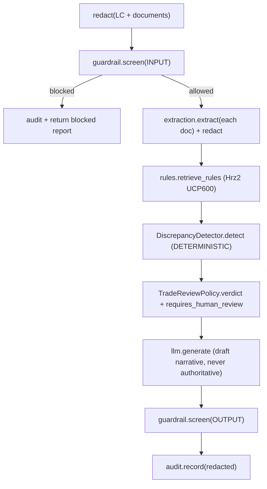

# Doc4 Trade-Finance Document Checker : Build Specification

> Single source of truth for the implementation. The contract layer
> (`src/trade_finance_checker/domain/models.py`, `src/trade_finance_checker/ports/`,
> `config.py`, `config/settings.yaml`, `pyproject.toml`) is **authoritative** : read it
> before writing any adapter, service, test, or Terraform. Do not change the contract;
> implement against it.

## 1. What Doc4 is

A trade-finance document checker for **Transaction Banking**. It parses a **Letter of
Credit** and the presented document set (invoice, bill of lading, insurance, packing list,
certificate of origin, draft) and detects **discrepancies** against the LC terms and the
**UCP600** rules. It is decision support for a trade-finance officer, not an approval. It
produces three cited artifacts:

1. **DiscrepancyReport** : the full check result for one presentation, with a deterministic
   `verdict` (COMPLIANT or DISCREPANT), a discrepancy count, and `requires_human_review=True`.
2. **Discrepancy[]** : each finding (UCP600 article, document type, field, expected per
   LC/UCP600, found, severity, citations).
3. **PresentationSummary** : the parsed LC terms + the documents checked, for traceability.

Catalog identity: **Doc4**, group **`doc`** (document automation), priority **P2**, buyer
**Transaction Banking**. Mandatory platform dependencies: **Hrz1** Guardrail Gateway, **Hrz2**
Enterprise KB (governed UCP600 rule set), **Hrz3** Registry, **Hrz4** AI Quality (eval gate),
**Hrz5** Observability/Audit. Doc4 handles trade-party PII, so rule **R1** applies (the full Hrz1
pipeline). Maker-checker (P-06) is mandatory: the officer decides.

## 2. Locked decisions

| # | Decision |
|---|---|
| Repo | `trade-finance-checker` (public, Apache-2.0), Python 3.12, ADK 2.3.0, React/Next.js UI |
| Extraction | **Document AI only** as the production backend, regional processor in `asia-southeast1`. |
| UCP600 rules | **Retrieved at runtime from Hrz2** (File Search over the UCP600 articles). The repo ships only the article registry + a synthetic sample; the text is never vendored. |
| Verdict | **Deterministic.** The verdict and the discrepancy set are computed by `DiscrepancyDetector` (pure domain). The LLM only drafts the narrative and can never override a finding. |
| Runtime | **Agent Runtime only** (managed, ex-Agent Engine) with GA Sessions + Memory Bank. |
| UI | **React / Next.js** app. |
| Region | `asia-southeast1` (Singapore) for every service. |
| Lock-in | Ports-and-adapters. GCP adapters are primary; **on-prem placeholder adapters** are `NotImplementedError` stubs satisfying the same Protocols (no third-party product named). Migration target is Google Distributed Cloud. |

## 3. Pinned stack (current GA, mid-2026)

Platform note: the product is **Gemini Enterprise Agent Platform**; the API host is
still `aiplatform.googleapis.com`.

| Concern | Service (current name) | Identifier |
|---|---|---|
| Agent framework | ADK (Python) | `google-adk==2.7.1` |
| Reasoning model | Gemini 3.5 Flash | `gemini-3.5-flash` (thinking=high) |
| Triage model | Gemini 3.1 Flash-Lite | `gemini-3.1-flash-lite` |
| Unified SDK | Google GenAI SDK | `google-genai` |
| Document extraction | Document AI | `google-cloud-documentai`; regional processor |
| UCP600 rule set | Hrz2 Enterprise KB (File Search) | `POST /v1/search` (`HRZ_KB_URL`) |
| Runtime | Agent Runtime (ex-Agent Engine) | `google-cloud-aiplatform[agent_engines,adk]`; `reasoningEngine` |
| Sessions / Memory | Agent Platform Sessions / Memory Bank | ADK `VertexAiSessionService` / `VertexAiMemoryBankService` |
| Guardrail | Model Armor | `modelarmor.asia-southeast1.rep.googleapis.com` `:sanitizeUserPrompt`/`:sanitizeModelResponse` |
| PII redaction | Sensitive Data Protection / DLP | `google-cloud-dlp` `deidentifyContent` |
| Audit (WORM) | Cloud Logging locked bucket + Audit Logs | retention 2557 days; `DATA_READ` enabled |
| Tracing | Cloud Trace via OpenTelemetry | `opentelemetry-exporter-gcp-trace`; content capture OFF |
| Eval gate | Gen AI evaluation service | `vertexai.Client(...).evals` |
| Interop | A2A v1.0 + MCP 2026-07-28 | AgentCard `/.well-known/agent-card.json`; ADK `to_a2a`, `McpToolset` |
| Sovereignty | VPC-SC, regional CMEK, Org Policy, Assured Workloads | `asia-southeast1` |

Gotchas honoured: regional endpoints + per-service CMEK for residency (global endpoint
gives none); message-content capture OFF in spans (PII); locked log bucket is irreversible
(retention is a Terraform var); never use the floating ADK default model or
`gemini-2.0-flash` (discontinued); one built-in tool per agent.

## 4. Adapter convention (the build contract)

* Every adapter constructor is `def __init__(self, settings: Settings) -> None`.
* Adapters are bound to ports by dotted path in `config/settings.yaml` under `adapters:`.
  **Module paths and class names there are fixed : match them exactly.**
* Four adapter families:
  * `adapters/gcp/*` : primary managed-service adapters (real SDK calls).
  * `adapters/local/*` : a WORKING offline stack (for `profile: local`), SDK-free and
    deterministic, that runs the whole pipeline with no Google Cloud, no API key, and no
    running emulators by default. See the profile table below.
  * `adapters/platform/*` : thin HTTP clients to Hrz1 to Hrz5 (for `profile: platform`).
  * `adapters/onprem/*` : placeholder stubs that raise `NotImplementedError("...on-prem
    migration target...")` from every method but **construct cleanly** and **satisfy the
    Protocol**. No third-party product named.
* GCP SDK imports must be **inside** methods/`__init__` (lazy), never at module top level.
  The default `local` path imports **no** google-cloud package at all.

### 4.1 Deployment profiles

| Profile | Backend | When |
|---------|---------|------|
| `gcp` | Managed Google Cloud services (lazy SDK imports). | Production default. |
| `local` | A WORKING offline laptop stack, SDK-free and deterministic. | Dev / test default. |
| `platform` | Thin HTTP clients to the Hrz1 to Hrz5 sibling services. | Inside the full platform. |
| `onprem` | Fail-fast placeholders (NotImplementedError); the Google Distributed Cloud exit. | Migration target. |

The `local` backends, per port: rules retrieval (UCP600) to **SQLite FTS5** (BM25 ranked,
self-seeding the governed article set); LLM to a deterministic schema-driven generator (no
model, no network); guardrail to a heuristic that blocks prompt-injection / jailbreak text;
PII redaction to regex de-identification driven by the configured jurisdiction packs
(`pii.jurisdictions`, default SG/HK/JP/AU) plus universal email / phone / account numbers,
from the same `domain/pii_patterns.py` source the DLP adapter and the eval gate read; document
extraction to a local plain-text / pypdf parser; audit to an append-only local store;
tracer to no-op spans; session / memory / registry to in-process stores; agent runtime to an
in-process check loop; evaluation to the in-repo offline eval gate.

**Optional emulator opt-in** (never required): when `FIRESTORE_EMULATOR_HOST` is set AND the
`[gcp]` client lib imports, the session / memory / registry adapters route to the Firestore
emulator (the google client is imported lazily, only on that branch). Unset, they use the
SDK-free in-process stores. There is no emulator for Document AI, Gemini, Model Armor, DLP or
FTS5 retrieval, so those stay on the SDK-free workaround unconditionally.

## 5. Orchestration pipeline (in `domain/`)

The `TradeCheckService` owns orchestration and calls only ports. Because Doc4 handles PII,
the **full R1 safety pipeline** runs:

> All steps wrapped in `tracer.span`.

Service and policies (constructors take explicit port instances; the API builds them from
`Container`):

* `TradeCheckService(extraction, rules, llm, guardrail, redaction, tracer, audit,
  detector=None, review_policy=None)` to `.check(lc, documents, actor) -> DiscrepancyReport`
  and `.extract(document, actor) -> DocumentExtract`.
* `DiscrepancyDetector(amount_tolerance_pct, description_min_overlap, as_of)` to
  `.detect(lc, extracts, rules) -> list[Discrepancy]`. The deterministic heart: invoice
  amount within the LC amount (plus tolerance), currency match, shipment on or before
  `latest_shipment`, presentation within `expiry_date`, goods description consistent across
  documents, required documents present, plus UCP600-article-tagged rule checks (e.g.
  insurance >= 110% of CIF value for CIF/CIP).
* `TradeReviewPolicy` to `.verdict(...)` (COMPLIANT iff zero material discrepancies),
  `.requires_review(...)` (always True), `.escalates(...)` (any HIGH/CRITICAL).
* Prompt templates live in `domain/prompts.py` (pure strings).
* `domain/serialization.py` to `to_jsonable(obj)` converts dataclasses/enums to JSON-safe
  dicts (used by remote clients and the API). Enums serialize to `.value`.

## 6. Service HTTP contracts

### 6.1 Endpoints Doc4 DEFINES (consumed by the UI / CLI / peers)

* `POST /v1/check` `{ "lc": {LetterOfCredit}, "documents": [{PresentedDocument}] }`
  to `DiscrepancyReport` `{ "lc_number", "documents_checked":[str], "discrepancies":[
  {Discrepancy} ], "verdict": "compliant"|"discrepant", "summary": {PresentationSummary},
  "requires_human_review": true, "narrative": str, "citations":[{Citation}],
  "discrepancy_count": int, "material_count": int, "generated_at": str }`
* `POST /v1/extract` `{ "document": {PresentedDocument} }` to
  `DocumentExtract` `{ "doc_type", "fields":{}, "pages", "document_id", "raw_text" }`
* `GET /healthz` to `{ "status": "ok", "profile": str, "region": str }`
* `GET /v1/personas` to `[{ "id", "subject", "tenant", "principals" }]` (seeded demo
  personas in the `local` profile, empty otherwise; drives the UI persona picker).
* `GET /.well-known/agent-card.json` to the A2A AgentCard.

The request body carries **no** `actor`: the audit actor is the server-verified `Principal`
resolved by the `IdentityPort` (`local` seeded persona via `X-Dev-Persona`, `gcp`/`platform`
IAP assertion, or `onprem` client IdP), never a client-supplied field. See
[`docs/embedding-and-identity.md`](docs/embedding-and-identity.md).

Skills advertised on the AgentCard: `check_presentation`, `detect_discrepancies`,
`extract_document`.

`Discrepancy` JSON: `{ "kind", "ucp600_article", "doc_type", "field", "expected", "found",
"severity", "citations":[{Citation}] }`. `Citation` JSON: `{ "source_id", "source_type":
"LC"|"UCP600"|"DOCUMENT", "title", "url", "page", "snippet", "score" }`.

### 6.2 Endpoints Doc4 CONSUMES (the platform dependencies)

All JSON field names mirror the domain dataclasses; enums are strings.

**Hrz1 `agent-guardrail-gateway`** (env `HRZ_GUARDRAIL_URL`, default `:8080`)
* `POST /v1/guardrail/screen` `{ text, direction }` to `{ allowed, direction, findings[],
  sanitized_text, reason }`

**Hrz2 `enterprise-knowledge-base`** (env `HRZ_KB_URL`, default `:8082`)
* `POST /v1/search` `{ query, top_k, acl_principals[], filters }` to `{ passages:[{ text,
  citation:{article|source_id, title, url}, score }] }` : the governed UCP600 articles.

**Hrz3 `agent-registry`** (env `HRZ_REGISTRY_URL`, default `:8083`)
* `POST /v1/agents` `{AgentCard}` to 201; `GET /v1/agents/{name}`; `GET /v1/agents`.

**Hrz4 `model-quality-gate`** (env `HRZ_QUALITY_URL`, default `:8084`)
* `POST /v1/evaluations` `{ target:{ model, prompt_version, dataset_id, system }, dataset_id,
  bundle:"doc4-trade-finance" }` to `{ results:[{ metric, score, threshold, passed }], n }`.
  The metric set is chosen by the registered `bundle` name : Doc4 never sends metric names on
  the wire (an unregistered name is rejected 422), and top-level `dataset_id` must equal
  `target.dataset_id` (422 on divergence). `RemoteEvaluationAdapter` maps `results[]` into
  `EvalReport`.
* `POST /v1/gate` (same body) to `{ passed }` : the promotion pass/fail decision.

**Hrz5 `agent-observability`** (env `HRZ_OBSERVABILITY_URL`, default `:8085`)
* `POST /v1/audit` `{AuditEvent}` to 202.

## 7. Coding standards

* Python 3.12, `from __future__ import annotations`, full type hints, ruff-clean.
* No secrets in code. Region pinned to `asia-southeast1`. Concrete Terraform values with
  `${var}` only for the project id and other genuinely per-tenant inputs.
* Tests must pass under the **local profile with no Google Cloud SDKs installed** (contract
  tests assert interface parity for both `local` and `onprem`; unit tests drive the domain
  service through the seeded `local` adapters).
* Each compliance control in `COMPLIANCE.md` maps to General Principles P-01..P-12 and
  dependency rules R1..R6.
